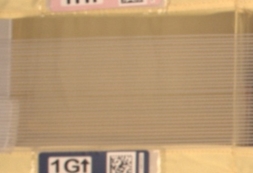
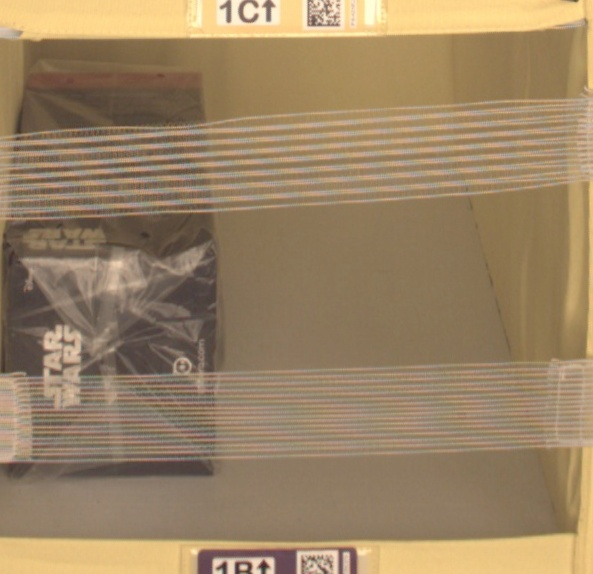
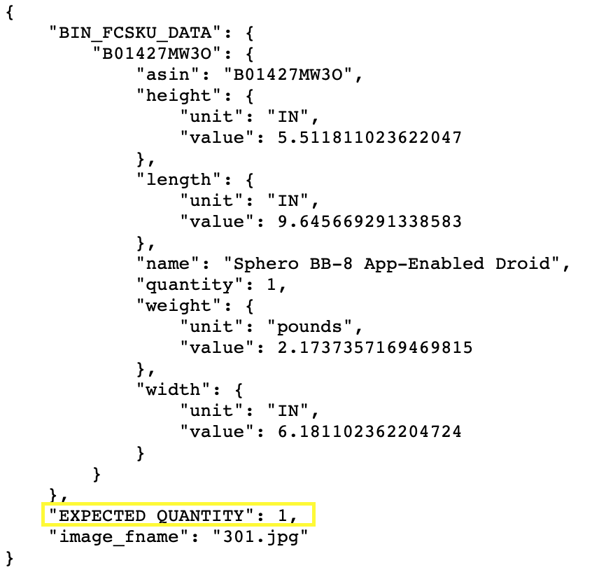
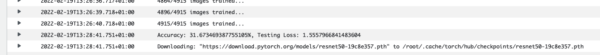
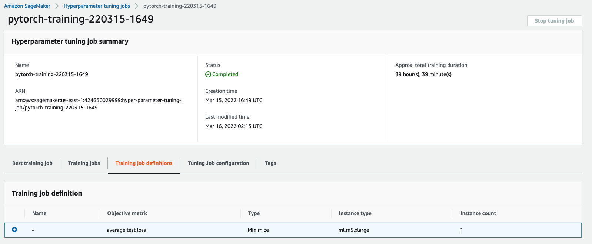
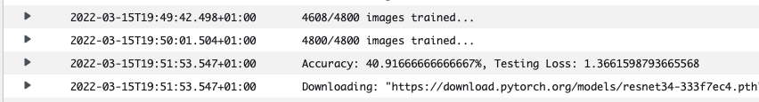
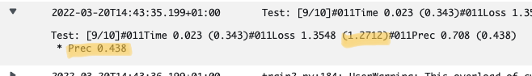
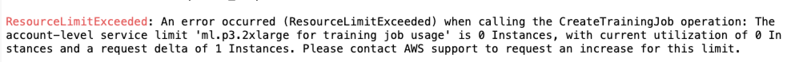

# Inventory Monitoring at Distribution Centers

## Definition

### Project Overview

Most distribution centers all over the world use robots to move objects from one place to another. These robots use bins which contains multiple objects. Determining the number of objects in each bin can be very valuable in order to check that the process is working as expected.

The main goal of this project is to build a ML model that can count the number of objects in each bin in order to track inventory and check that bins have the appropriate number of items in order to reduce stock mismatches. 

### Problem Statement

Based on the background, it can be seen that the problem to be resolved here is related to image classification. A ton of images have been provided by our client (Amazon) and a ML model will be built in order to identify the number of objects in each bin.

### Metrics

For this case, we will use both, the model accuracy (based on the images which are correctly identified by the model) and the Root Mean Square Error (RMSE) metrics in order to evaluate how the model is performing.

These metrics will be used at the end of each epoch in order to observe how the model is improving its results. 

## Analysis

### Data Exploration

The dataset used for the project will be the [Amazon Bin Image Dataset](https://registry.opendata.aws/amazon-bin-imagery/) which contains more than 500,000 images and metadata from bins of a pod in an operating Amazon Fulfillment Center. Both, images and metadata, will be used to develop the model. 

Images will be used as the main input in the training phase. Metadata will be used in order to arrange the pictures in a way that the ML model will identify the number of possible classes.

Amazon provide us with these images via S3. Specifically, both, images and metadata, are stored on the `aft-vbi-pds` bucket. 

* Images are stored in the `bin-images` folder. Each image is a different `JPG` file whose name is similar to `<X>.jpg` being `<X>` a number. 
* Metadata is stored in the `metadata` folder. Each image has a corresponding metadata file whose format is JSON. The most important field of these JSON files is `EXPECTED_QUANTITY` as it contains the number of objects which can be found on the specific image. 

For the scope of this project, we will focus on pictures contain 0 to 5 objects. 

### Exploratory Visualization

The following picture is an example of a bin with no objects.

While this one is an example of a bin with 1 object:

As can be seen, each picture has different sizes, so it will be critical to resize all these pictures un order the model to work properly. 

On the other hand, here is an example of a metadata file. In this case, the JSON is describing a picture with one object (it refers to the previous picture):

 

### Algorithms and Techniques

In this project a ML model has been built to identify the number of objects in each image. In order to build this ML model, SageMaker has been used, training a model using a ResNet neuronal network. 

ResNet model is widely used for image classification which is pretrained and can be customized in order to categorize images from different use cases. To adapt this pretrained model to our use case, different training jobs will be launched in AWS SageMaker. In addition, hyperparameters tunning jobs has been launched in order to find the most appropriate combination of hyperparameters for our use case. 

### Benchmark

Others have worked on the same data to build their own models. Specifically, we can find two GitHub projects related to this problem:

1. [Amazon Bin Image Dataset (ABID) Challenge by silverbottlep](https://github.com/silverbottlep/abid_challenge)
2. [Amazon Inventory Reconciliation using AI by Pablo Rodriguez Bertorello, Sravan Sripada, Nutchapol Dendumrongsup](https://github.com/pablo-tech/Image-Inventory-Reconciliation-with-SVM-and-CNN)

As can be seen in the conclusions of both projects, the obtained accuracy is 55% approximately with a RMSE of 0.94. In the results sections, a comparison between the results of my model and the results of these project can be found.  

## Methodology

### Data preprocessing

The first step to train a model is to download an process the data which will be used as the input. As stated before, we have decided to focus on pictures with 0 to 5 objects. Each picture will be assigned a class according to the following rule:

* Class 1 for pictures without objects
* Class 2 for pictures with 1 object
* Class 3 for pictures with 2 objects
* Class 4 for pictures with 3 objects
* Class 5 for pictures with 4 objects
* Class 6 for pictures with 5 objects

For each class, I decided to download 1,000 images: 800 will be used as input for the training phase, while 200 will be used as input for the validation phase.

In order to download these 6,000 pictures, a Python script has been created. The script can be found at the project Jupyter notebook (file `sagemaker.ipynb`). Specifically, the script will iterate over the JSON files from the Amazon dataset and will download the picture if it contains 0 to 5 objects and the number of objects downloaded for the specific class is below 1,000. 

Finally, all these pictures were uploaded to S3, as it is the entry point for data for models being trained on AWS. 

### Implementation

As stated before, I planned to use a ResNet neuronal network to train the model. As a base I used [this Python training script](https://github.com/aitormagan/CD0387-deep-learning-topics-within-computer-vision-nlp-project-starter/blob/main/train_model.py), which is the one I implemented for the "Image Classification" project of this course (file `train.py`). The following adjustements were made:

1. Number of classes is 6
2. Apply transformations:
   1. Resize images to 224x224 so all the images have the same size
   2. Apply random horizontal flip
   3. Apply normalizationn (zero mean and unit variance)

Then I launched this script through the Jupyter Notebook. However, the first results, as can be seen on this screenshot, were not very promising, with an average loss of 1.55 and an accuracy of 31,60%.

This first script used a pretrained ResNet18 neuronal network for training. In order to obtain a more accurate model, I tried the same script but with different ResNet networks. I tested with ResNet50 and the results were pretty similar.

However, reading the [project done by Pablo Rodriguez et al.](https://github.com/pablo-tech/Image-Inventory-Reconciliation-with-SVM-and-CNN), I discovered they were using a ResNet34 non-pretrained network, so I decided to move my project to this implementation (ResNet34) but with a pretrained network. With this implementation, accuracy was 38% and average loss dropped to 1.38, which was not perfect but better than the results obtained on the first attempt.

### Refinement

At this state, I decided it was high time to tune the hyperparameters in order to find a better combination of them which allow me to obtain a more precise model. Specifically, these hyperparameters were tuned:

* The number of epochs
* The batch size (the number of images being trained on each iteration)
* The learning rate (`lr`)

Here is a screenshot of the hyperparameters job launched on AWS:

After completing, the best hyperparameters combination was the following one:

* Epochs: 12
* Batch Size: 256
* Learning Rate: 0.0055476177746041485

With this combination, testing accuracy spiked to 41% and average loss was reduced to 1.36, as can be seen on the following screenshot. 

## Results

### Model Evaluation and Validation

In order to calculate the RMSE and compare the results of my models with the ones developer by others, I deployed the model and executed an inference for every test objects (check the Jupyter notebook). Here are the results:

| Class | Accuracy | RMSE |
|---|---|---|
| 0 | 89% | 0.52 |
| 1 | 37.5% | 2.12 |
| 2 | 13.5% | 1.91 |
| 3 | 12% | 1.55 |
| 4 | 33.5% | 1.15 |
| 5 | 43% | 1.49 |
| Average | 45.7% | 1.70 |

As can be seen on this table, results are very poor if compared with the ones obtained on other projects such as the one developer by [Pablo Rodriguez et al.](https://github.com/pablo-tech/Image-Inventory-Reconciliation-with-SVM-and-CNN) were a RMSE of 0.94 is obtained on the testing phase. At this point, I decided to launch [their training script](https://github.com/pablo-tech/Image-Inventory-Reconciliation-with-SVM-and-CNN/blob/master/convolutional-neural-network/training.py) against my dataset. 

To do so, I modified their script so it can be run on AWS with the input being stored on S3 (file: `train_external.py`). Once executed, here is an screenshot of the results I obtained:

As can be seen, results with the same input was pretty close to what I obtained, with an average loss of 1.27 and an accuracy of 43,8%. It's important to note that while their script requires 40 epochs to obtain this result, my script only requires 12, so the problem is not with my training script but with the model input. 

### Justification

It is important to note that the results obtained by the team of Pablo Rodriguez were achieved by using a dataset of 150k images (according to their paper) which can be processed in an assumable amount of time when using GPUs. However, when I tried to adapt my script to be run on GPUs, I found that Udacity has limited by ability to launch jobs where GPUs are available as can be seen on the following screeshot.

At this stage, the only option for my model to be more precise is to have a bigger dataset. However, dealing with a bigger dataset requires a level of computational power which I cannot use due to the limitations of the platform. A good continuation for this project will be trying to train the model on GPUs with a bigger dataset (+100k images).

Nevertheless, it's important to remark that the model I developed, has a similar average loss and accuracy than the one developed by the team of Pablo Rodriguez when the same input dataset is used. 

A random guesser will be able to clasify a 16% of the pictures (`100/6=16.66....`). Hence, my model will be more precise than a random guesser when trying to identify bins with 0, 1, 4 and 5 objects.